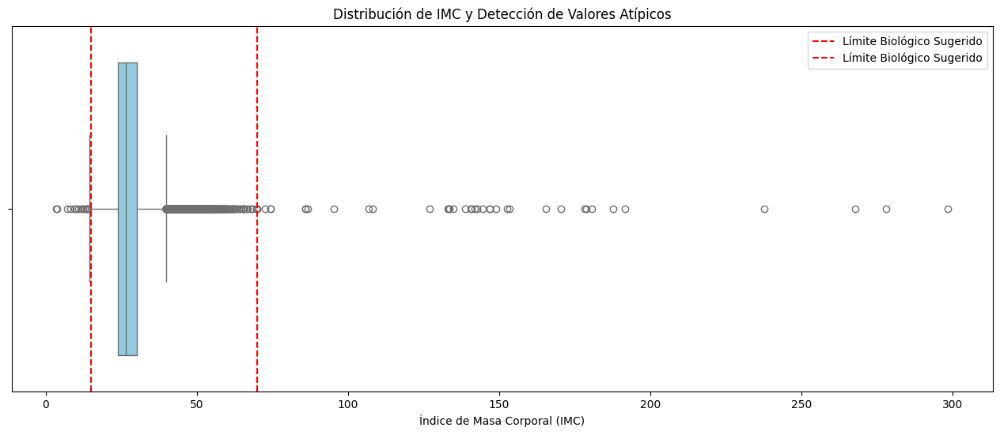
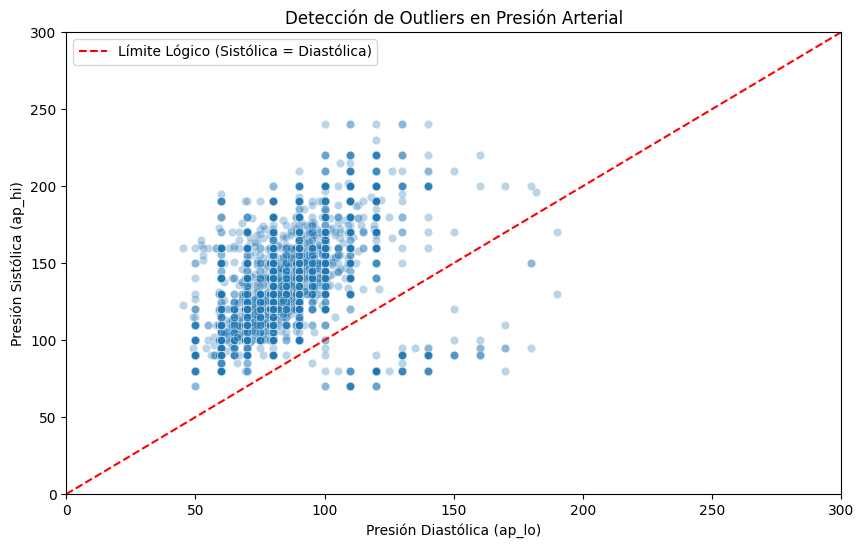
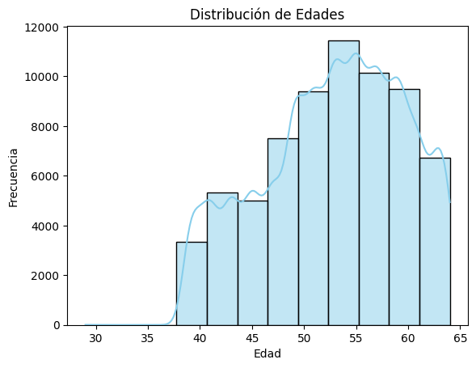
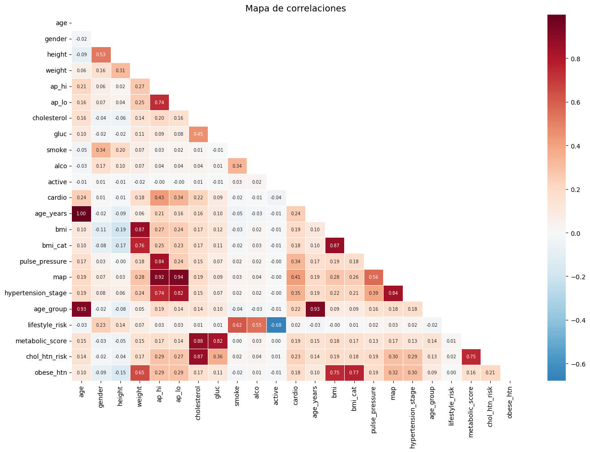
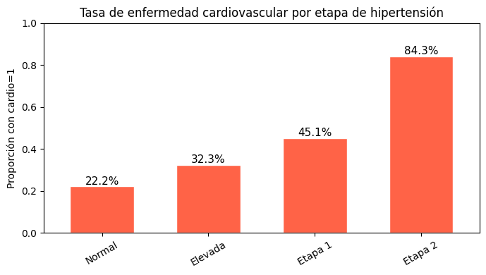
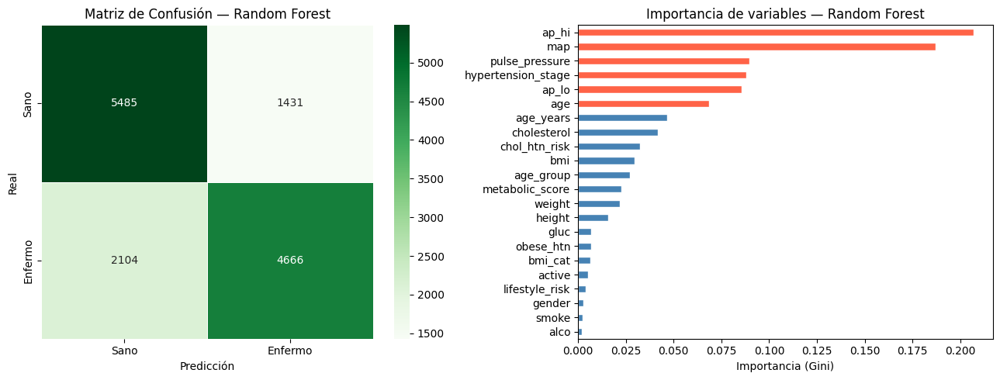
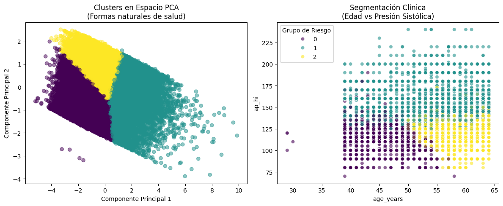
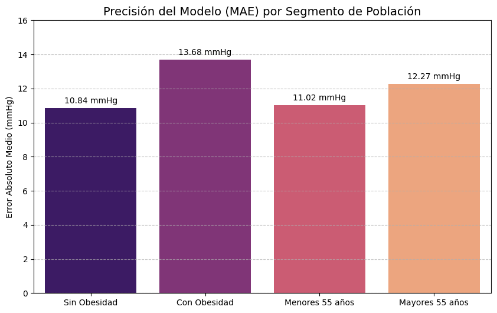

# ❤️ Cardiovascular Disease Risk — Data Science Project

End-to-end data science project analyzing cardiovascular disease risk factors: data cleaning,
exploratory data analysis, feature engineering, and three predictive models (classification,
clustering, and regression). Developed as part of the **Samsung Innovation Campus** program.

## 📌 Project Overview

Using a dataset of **70,000 patient records**, this project explores which health and
lifestyle factors are associated with cardiovascular disease, and builds models to:

1. **Classify** whether a patient has cardiovascular disease (Random Forest)
2. **Cluster** patients into risk segments based on health metrics (K-Means)
3. **Predict** systolic blood pressure (`ap_hi`) from other health indicators (Regression)

## 🧹 Data Cleaning

Applied biologically-informed outlier removal on BMI, weight, height, and blood pressure
(e.g. removing physiologically impossible readings like systolic pressure lower than diastolic):

| Criterion | Records removed |
|---|---|
| BMI outside [15, 60] | 64 |
| Weight outside [30, 200] kg | 14 |
| Height outside [130, 210] cm | 163 |
| Negative/zero blood pressure | 29 |
| ap_hi outside [70, 250] mmHg | 210 |
| ap_lo outside [40, 200] mmHg | 993 |
| ap_hi ≤ ap_lo (physiologically impossible) | 101 |
| **Total removed** | **1,574 (2.25%)** |

**Final clean dataset:** 68,426 records




## 📊 Exploratory Data Analysis

Key patterns identified during EDA:





**Insight:** Blood pressure (`ap_hi`, `ap_lo`) and derived hypertension stage show the
strongest correlation with cardiovascular disease, followed by age, cholesterol, and BMI.

## ⚙️ Feature Engineering

Created domain-informed features to improve model performance:
- **BMI** and BMI category
- **Pulse pressure** (ap_hi − ap_lo)
- **MAP** (Mean Arterial Pressure)
- **Hypertension stage** (based on JNC 7 clinical classification)
- **Age group** buckets
- **Lifestyle risk score** (smoking, alcohol, physical inactivity)
- **Metabolic score** (cholesterol + glucose)

## 🤖 Modeling Results

### 1. Classification — Random Forest (predicting cardiovascular disease)

| Metric | Score |
|---|---|
| Accuracy | 0.742 |
| Precision | 0.765 |
| Recall | 0.689 |
| F1-Score | 0.725 |
| ROC-AUC | 0.808 |



### 2. Clustering — K-Means (patient risk segmentation)

- **Silhouette Score:** 0.30 (acceptable for health/behavioral data)
- Segmented patients using age, BMI, blood pressure, cholesterol, glucose, and derived risk scores



### 3. Regression — Predicting Systolic Blood Pressure

| Model | MAE | R² |
|---|---|---|
| Ridge (Linear) | 11.56 mmHg | 0.126 |
| Random Forest (Non-linear) | 11.58 mmHg | 0.128 |

**Error analysis by segment:**

| Segment | MAE |
|---|---|
| Without obesity | 10.84 mmHg |
| With obesity | 13.68 mmHg |
| Age < 55 | 11.02 mmHg |
| Age > 55 | 12.27 mmHg |



**Insight:** The regression model shows higher error for obese and older patients — suggesting
blood pressure is harder to predict from lifestyle/demographic factors alone in these groups,
likely due to additional unmeasured clinical factors.

## 🛠️ Tools & Technologies

- Python
- Pandas, NumPy
- Matplotlib, Seaborn
- Scikit-learn (Random Forest, K-Means, Ridge Regression, PCA, StandardScaler)

## 📁 Repository Structure

```
Cardio-Risk-Analysis/
│
├── README.md
├── data/
│   └── cardio_train_clean.csv
├── notebooks/
│   └── cardio_analysis.ipynb
└── images/
    └── (23 exported charts from the analysis)
```

## 🚀 Getting Started

```bash
git clone https://github.com/AriadneRomero/Cardio-Risk-Analysis.git
cd Cardio-Risk-Analysis
pip install pandas numpy matplotlib seaborn scikit-learn jupyter
jupyter notebook notebooks/cardio_analysis.ipynb
```

---
*Final project developed for the Samsung Innovation Campus program.*

